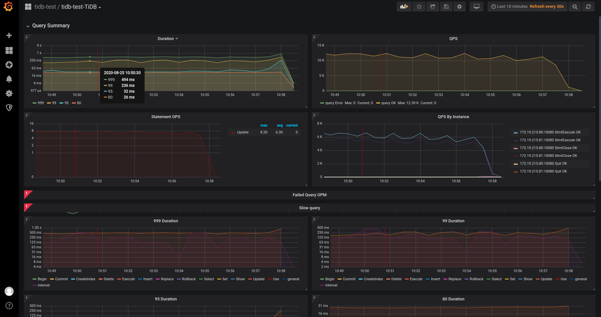

# 课程02 作业

## 环境

|IP|CPU|内存|硬盘|OS|备注|
|-|-|-|-|-|-|
|172.19.215.74|8核|16G|SSD180G|Ubuntu 20.04|TIKV&PD|
|172.19.215.75|8核|16G|SSD180G|Ubuntu 20.04|TIKV&PD|
|172.19.215.78|8核|16G|SSD180G|Ubuntu 20.04|TIKV&PD|
|172.19.215.80|8核|16G|SSD40G|Ubuntu 20.04|TIDB|
|172.19.215.81|8核|16G|SSD40G|Ubuntu 20.04|TIDB|
|172.19.215.84|4核|4G|SSD40G|Ubuntu 20.04|监控&施压机|


## 部署

使用 TIUP 部署 ([TIUP 安装文档](https://docs.pingcap.com/zh/tidb/stable/production-deployment-using-tiup))

TIUP 配置:
```ymal
global:
  user: "tidb"
  ssh_port: 22
  deploy_dir: "/tidb-deploy"
  data_dir: "/tidb-data"

pd_servers:
  - host: 172.19.215.78
  - host: 172.19.215.74
  - host: 172.19.215.75

tidb_servers:
  - host: 172.19.215.81
  - host: 172.19.215.80

tikv_servers:
  - host: 172.19.215.78
  - host: 172.19.215.74
  - host: 172.19.215.75

monitoring_servers:
  - host: 172.19.215.84

grafana_servers:
  - host: 172.19.215.84

alertmanager_servers:
  - host: 172.19.215.84
```

部署集群

`tiup cluster deploy tidb-test v4.0.0 ./topology.yaml --user root -p`

启动集群

`tiup cluster start tidb-test`

检查集群状态

`tiup cluster display tidb-test`

```shell
Starting component `cluster`:  display tidb-test
tidb Cluster: tidb-test
tidb Version: v4.0.0
ID                   Role          Host           Ports        OS/Arch       Status  Data Dir                      Deploy Dir
--                   ----          ----           -----        -------       ------  --------                      ----------
172.19.215.84:9093   alertmanager  172.19.215.84  9093/9094    linux/x86_64  Up      /tidb-data/alertmanager-9093  /tidb-deploy/alertmanager-9093
172.19.215.84:3000   grafana       172.19.215.84  3000         linux/x86_64  Up      -                             /tidb-deploy/grafana-3000
172.19.215.74:2379   pd            172.19.215.74  2379/2380    linux/x86_64  Up|UI   /tidb-data/pd-2379            /tidb-deploy/pd-2379
172.19.215.75:2379   pd            172.19.215.75  2379/2380    linux/x86_64  Up      /tidb-data/pd-2379            /tidb-deploy/pd-2379
172.19.215.78:2379   pd            172.19.215.78  2379/2380    linux/x86_64  Up|L    /tidb-data/pd-2379            /tidb-deploy/pd-2379
172.19.215.84:9090   prometheus    172.19.215.84  9090         linux/x86_64  Up      /tidb-data/prometheus-9090    /tidb-deploy/prometheus-9090
172.19.215.80:4000   tidb          172.19.215.80  4000/10080   linux/x86_64  Up      -                             /tidb-deploy/tidb-4000
172.19.215.81:4000   tidb          172.19.215.81  4000/10080   linux/x86_64  Up      -                             /tidb-deploy/tidb-4000
172.19.215.74:20160  tikv          172.19.215.74  20160/20180  linux/x86_64  Up      /tidb-data/tikv-20160         /tidb-deploy/tikv-20160
172.19.215.75:20160  tikv          172.19.215.75  20160/20180  linux/x86_64  Up      /tidb-data/tikv-20160         /tidb-deploy/tikv-20160
172.19.215.78:20160  tikv          172.19.215.78  20160/20180  linux/x86_64  Up      /tidb-data/tikv-20160         /tidb-deploy/tikv-20160

```


TIDB Dashboard


Grafana 监控


使用 HAProxy 代理 TIDB

在 172.19.215.80 中安装 HAPROXY [安装文档](https://docs.pingcap.com/zh/tidb/stable/haproxy-best-practices#%E5%90%AF%E5%8A%A8-haproxy)。

HAProxy 配置
```shell
# /etc/haproxy/haproxy.cfg

global                                     # 全局配置。
   log         127.0.0.1 local2            # 定义全局的 syslog 服务器，最多可以定义两个。
   chroot      /var/lib/haproxy            # 更改当前目录并为启动进程设置超级用户权限，从而提高安全性。
   pidfile     /var/run/haproxy.pid        # 将 HAProxy 进程的 PID 写入 pidfile。
   maxconn     4000                        # 每个 HAProxy 进程所接受的最大并发连接数。
   user        haproxy                     # 同 UID 参数。
   group       haproxy                     # 同 GID 参数，建议使用专用用户组。
   nbproc      40                          # 在后台运行时创建的进程数。在启动多个进程转发请求时，确保该值足够大，保证 HAProxy 不会成为瓶颈。
   daemon                                  # 让 HAProxy 以守护进程的方式工作于后台，等同于命令行参数“-D”的功能。当然，也可以在命令行中用“-db”参数将其禁用。
   stats socket /var/lib/haproxy/stats     # 统计信息保存位置。

defaults                                   # 默认配置。
   log global                              # 日志继承全局配置段的设置。
   retries 2                               # 向上游服务器尝试连接的最大次数，超过此值便认为后端服务器不可用。
   timeout connect  2s                     # HAProxy 与后端服务器连接超时时间。如果在同一个局域网内，可设置成较短的时间。
   timeout client 30000s                   # 客户端与 HAProxy 连接后，数据传输完毕，即非活动连接的超时时间。
   timeout server 30000s                   # 服务器端非活动连接的超时时间。
listen admin_stats                         # frontend 和 backend 的组合体，此监控组的名称可按需进行自定义。
   bind 0.0.0.0:8080                       # 监听端口。
   mode http                               # 监控运行的模式，此处为 `http` 模式。
   option httplog                          # 开始启用记录 HTTP 请求的日志功能。
   maxconn 10                              # 最大并发连接数。
   stats refresh 30s       
                   # 每隔 30 秒自动刷新监控页面。
   stats uri /haproxy                      # 监控页面的 URL。
   stats realm HAProxy                     # 监控页面的提示信息。
   stats auth admin:tidb123abc             # 监控页面的用户和密码，可设置多个用户名。
   stats hide-version                      # 隐藏监控页面上的 HAProxy 版本信息。
   stats  admin if TRUE                    # 手工启用或禁用后端服务器（HAProxy 1.4.9 及之后版本开始支持）。

listen tidb-cluster                        # 配置 database 负载均衡。
   bind 0.0.0.0:3390                       # 浮动 IP 和 监听端口。
   mode tcp                                # HAProxy 要使用第 4 层的传输层。
   balance leastconn                       # 连接数最少的服务器优先接收连接。`leastconn` 建议用于长会话服务，例如 LDAP、SQL、TSE 等，而不是短会话协议，如 HTTP。该算法是动态的，对于启动慢的服务器，服务器权重会在运行中作调整。
   server tidb-1 172.19.215.81:4000 check inter 2000 rise 2 fall 3       # 检测 4000 端口，检测频率为每 2000 毫秒一次。如果 2 次检测为成功，则认为服务器可用；如果 3 次检测为失败，则认为服务器不可用。
   server tidb-2 172.19.215.80:4000 check inter 2000 rise 2 fall 3
```
启动 HAProxy

`haproxy -f /etc/haproxy/haproxy.cfg`

访问 `http://ip:8080/haproxy` 可以查看代理状态


至此 TIDB 集群部署完毕。


## 测试

### 1. sysbench

#### 安装 sysbench 
```shell
curl -s https://packagecloud.io/install/repositories/akopytov/sysbench/script.deb.sh | sudo bash

sudo apt -y install sysbench
```

#### sysbench 配置文件
```
mysql-host=172.19.215.80
mysql-port=3390
mysql-user=root
mysql-password=
mysql-db=sbtest
time=600
threads=16
report-interval=10
db-driver=mysql
```

#### 创建数据库并设置乐观事务模式

`mysql -u root -h 172.19.215.80 -P 3390`
```
mysql> create database sbtest;
mysql> set global tidb_disable_txn_auto_retry = off;
mysql> set global tidb_txn_mode="optimistic";
```

#### 导入数据

`nohup sysbench --config-file=config oltp_point_select --threads=128 --tables=32 --table-size=500000 prepare 2>&1 &`

#### 数据导入成功，恢复悲观事务。
```
mysql> set global tidb_txn_mode="pessimistic";
```

#### Point select 测试

`sysbench --config-file=config oltp_point_select --threads=256 --tables=32 --table-size=500000 run`

```
sysbench 1.0.20 (using bundled LuaJIT 2.1.0-beta2)

Running the test with following options:
Number of threads: 256
Report intermediate results every 10 second(s)
Initializing random number generator from current time


Initializing worker threads...


Threads started!


[ 10s ] thds: 256 tps: 91863.72 qps: 91863.72 (r/w/o: 91863.72/0.00/0.00) lat (ms,95%): 8.13 err/s: 0.00 reconn/s: 0.00
...
...
...
[ 600s ] thds: 256 tps: 95278.57 qps: 95278.57 (r/w/o: 95278.57/0.00/0.00) lat (ms,95%): 8.43 err/s: 0.00 reconn/s: 0.00
SQL statistics:
    queries performed:
        read:                            56378716
        write:                           0
        other:                           0
        total:                           56378716
    transactions:                        56378716 (93954.66 per sec.)
    queries:                             56378716 (93954.66 per sec.)
    ignored errors:                      0      (0.00 per sec.)
    reconnects:                          0      (0.00 per sec.)

General statistics:
    total time:                          600.0614s
    total number of events:              56378716

Latency (ms):
         min:                                    0.40
         avg:                                    2.72
         max:                                   59.86
         95th percentile:                        8.43
         sum:                            153564385.49

Threads fairness:
    events (avg/stddev):           220229.3594/109371.77
    execution time (avg/stddev):   599.8609/0.10
```
Graafana tidb query summary


Graafana tikv cluster


Graafana tikv grpc


#### Update index 测试

`sysbench --config-file=config oltp_update_index --threads=256 --tables=32 --table-size=500000 run`

```
sysbench 1.0.20 (using bundled LuaJIT 2.1.0-beta2)

Running the test with following options:
Number of threads: 256
Report intermediate results every 10 second(s)
Initializing random number generator from current time


Initializing worker threads...

Threads started!

[ 10s ] thds: 256 tps: 14391.32 qps: 14391.32 (r/w/o: 0.00/14080.48/310.84) lat (ms,95%): 22.28 err/s: 0.00 reconn/s: 0.00
...
...
...
[ 600s ] thds: 256 tps: 4593.93 qps: 4593.93 (r/w/o: 0.00/4494.93/99.00) lat (ms,95%): 308.84 err/s: 0.00 reconn/s: 0.00
SQL statistics:
    queries performed:
        read:                            0
        write:                           6723627
        other:                           148656
        total:                           6872283
    transactions:                        6872283 (11450.85 per sec.)
    queries:                             6872283 (11450.85 per sec.)
    ignored errors:                      0      (0.00 per sec.)
    reconnects:                          0      (0.00 per sec.)

General statistics:
    total time:                          600.1533s
    total number of events:              6872283

Latency (ms):
         min:                                    0.56
         avg:                                   22.35
         max:                                 3584.85
         95th percentile:                       30.26
         sum:                            153615313.12

Threads fairness:
    events (avg/stddev):           26844.8555/381.79
    execution time (avg/stddev):   600.0598/0.05
```

Graafana tidb query summary



Graafana tikv cluster


#### Read-only 测试

`sysbench --config-file=config oltp_read_only --threads=256 --tables=32 --table-size=500000 run`

```
sysbench 1.0.20 (using bundled LuaJIT 2.1.0-beta2)

Running the test with following options:
Number of threads: 256
Report intermediate results every 10 second(s)
Initializing random number generator from current time


Initializing worker threads...

Threads started!

[ 10s ] thds: 256 tps: 2415.04 qps: 38827.36 (r/w/o: 33974.28/0.00/4853.08) lat (ms,95%): 150.29 err/s: 0.00 reconn/s: 0.00
...
...
...
[ 600s ] thds: 256 tps: 2420.75 qps: 38750.34 (r/w/o: 33909.25/0.00/4841.09) lat (ms,95%): 153.02 err/s: 0.00 reconn/s: 0.00
SQL statistics:
    queries performed:
        read:                            20253366
        write:                           0
        other:                           2893338
        total:                           23146704
    transactions:                        1446669 (2410.36 per sec.)
    queries:                             23146704 (38565.79 per sec.)
    ignored errors:                      0      (0.00 per sec.)
    reconnects:                          0      (0.00 per sec.)

General statistics:
    total time:                          600.1858s
    total number of events:              1446669

Latency (ms):
         min:                                   12.81
         avg:                                  106.18
         max:                                  471.25
         95th percentile:                      153.02
         sum:                            153611083.10

Threads fairness:
    events (avg/stddev):           5651.0508/875.76
    execution time (avg/stddev):   600.0433/0.04
```

Graafana tidb query summary


Graafana tikv cluster


Graafana tikv grpc


### 2. go-ycsb

#### 安装 go-ycsb
```shell
git clone https://github.com/pingcap/go-ycsb.git
cd go-ycsb
make
```

#### 导入数据

```
./bin/go-ycsb load mysql -P workloads/workloada -p recordcount=5000000 -p mysql.host=172.19.215.80 -p mysql.port=3390 --threads 256

...
Run finished, takes 13m8.214554573s
```

#### 运行
```
./bin/go-ycsb run mysql -P workloads/workloada -p operationcount=5000000 -p mysql.host=172.19.215.80 -p mysql.port=3390 --threads 256
```

Graafana tidb query symmary


Graafana tikv cluster


### 3. go-tpc

#### 安装 go-tpc

```
git clone https://github.com/pingcap/go-tpc.git
cd go-tpc
make build
```

#### 导入数据

```
./bin/go-tpc tpcc -H 172.19.215.80 -P 3390 -D tpcc --warehouses 300 prepare -T 256
```

#### 运行

```shell
./bin/go-tpc tpcc -H 172.19.215.80 -P 3390 -D tpcc --warehouses 300 run --time 10m --threads 256

...
Finished
[Summary] DELIVERY - Takes(s): 1.2, Count: 50, TPM: 2552.7, Sum(ms): 5907, Avg(ms): 118, 90th(ms): 256, 99th(ms): 512, 99.9th(ms): 512
[Summary] NEW_ORDER - Takes(s): 1.4, Count: 354, TPM: 15519.1, Sum(ms): 31724, Avg(ms): 89, 90th(ms): 192, 99th(ms): 256, 99.9th(ms): 512
[Summary] NEW_ORDER_ERR - Takes(s): 1.4, Count: 101, TPM: 4427.7, Sum(ms): 2371, Avg(ms): 23, 90th(ms): 48, 99th(ms): 256, 99.9th(ms): 256
[Summary] ORDER_STATUS - Takes(s): 1.3, Count: 34, TPM: 1570.1, Sum(ms): 922, Avg(ms): 27, 90th(ms): 64, 99th(ms): 96, 99.9th(ms): 96
[Summary] ORDER_STATUS_ERR - Takes(s): 1.3, Count: 15, TPM: 692.7, Sum(ms): 298, Avg(ms): 19, 90th(ms): 48, 99th(ms): 48, 99.9th(ms): 48
[Summary] PAYMENT - Takes(s): 1.3, Count: 353, TPM: 16119.8, Sum(ms): 23861, Avg(ms): 67, 90th(ms): 128, 99th(ms): 256, 99.9th(ms): 256
[Summary] PAYMENT_ERR - Takes(s): 1.3, Count: 140, TPM: 6393.1, Sum(ms): 6202, Avg(ms): 44, 90th(ms): 112, 99th(ms): 256, 99.9th(ms): 256
[Summary] STOCK_LEVEL - Takes(s): 1.3, Count: 41, TPM: 1930.3, Sum(ms): 1555, Avg(ms): 37, 90th(ms): 80, 99th(ms): 160, 99.9th(ms): 160
tpmC: 15518.1
```

## 性能分析
在测试的过程中发现两个 TIDB 节点的 CPU 负载很高，因此增加一个 TIDB 节点。
修改 TIUP 配置为:

```yaml
global:
  user: "tidb"
  ssh_port: 22
  deploy_dir: "/tidb-deploy"
  data_dir: "/tidb-data"

pd_servers:
  - host: 172.19.215.89
  - host: 172.19.215.87
  - host: 172.19.215.86

tidb_servers:
  - host: 172.19.215.81
  - host: 172.19.215.80
  # 新增一个 4C8G 的节点
  - host: 172.19.215.92

tikv_servers:
  - host: 172.19.215.89
  - host: 172.19.215.87
  - host: 172.19.215.86

monitoring_servers:
  - host: 172.19.215.84

grafana_servers:
  - host: 172.19.215.84

alertmanager_servers:
  - host: 172.19.215.84
```

重新部署 TIDB 集群


修改 HAProxy 配置文件，在最后新增一行 

`server tidb-3 172.19.215.92:4000 check inter 2000 rise 2 fall 3`

代理了 3 个节点


再次运行 sysbench 测试

#### Point select 测试

`sysbench --config-file=config oltp_point_select --threads=256 --tables=32 --table-size=500000 run`

```
sysbench 1.0.20 (using bundled LuaJIT 2.1.0-beta2)

Running the test with following options:
Number of threads: 256
Report intermediate results every 10 second(s)
Initializing random number generator from current time


Initializing worker threads...

Threads started!

[ 10s ] thds: 256 tps: 112630.42 qps: 112630.42 (r/w/o: 112630.42/0.00/0.00) lat (ms,95%): 5.99 err/s: 0.00 reconn/s: 0.00
...
...
...
[ 600s ] thds: 256 tps: 118090.22 qps: 118090.22 (r/w/o: 118090.22/0.00/0.00) lat (ms,95%): 5.77 err/s: 0.00 reconn/s: 0.00
SQL statistics:
    queries performed:
        read:                            73248715
        write:                           0
        other:                           0
        total:                           73248715
    transactions:                        73248715 (122068.28 per sec.)
    queries:                             73248715 (122068.28 per sec.)
    ignored errors:                      0      (0.00 per sec.)
    reconnects:                          0      (0.00 per sec.)

General statistics:
    total time:                          600.0618s
    total number of events:              73248715

Latency (ms):
         min:                                    0.41
         avg:                                    2.10
         max:                                  319.89
         95th percentile:                        5.18
         sum:                            153549623.78

Threads fairness:
    events (avg/stddev):           286127.7930/133761.37
    execution time (avg/stddev):   599.8032/0.16
```


#### Read-only 测试

`sysbench --config-file=config oltp_read_only --threads=256 --tables=32 --table-size=500000 run`

```
sysbench 1.0.20 (using bundled LuaJIT 2.1.0-beta2)

Running the test with following options:
Number of threads: 256
Report intermediate results every 10 second(s)
Initializing random number generator from current time


Initializing worker threads...


Threads started!

[ 10s ] thds: 256 tps: 2921.49 qps: 46952.04 (r/w/o: 41084.36/0.00/5867.68) lat (ms,95%): 134.90 err/s: 0.00 reconn/s: 0.00
...
...
...
[ 600s ] thds: 256 tps: 2984.85 qps: 47733.88 (r/w/o: 41765.38/0.00/5968.50) lat (ms,95%): 132.49 err/s: 0.00 reconn/s: 0.00
SQL statistics:
    queries performed:
        read:                            24601262
        write:                           0
        other:                           3514466
        total:                           28115728
    transactions:                        1757233 (2927.66 per sec.)
    queries:                             28115728 (46842.53 per sec.)
    ignored errors:                      0      (0.00 per sec.)
    reconnects:                          0      (0.00 per sec.)

General statistics:
    total time:                          600.2163s
    total number of events:              1757233

Latency (ms):
         min:                                   12.27
         avg:                                   87.42
         max:                                  560.85
         95th percentile:                      134.90
         sum:                            153612252.02

Threads fairness:
    events (avg/stddev):           6864.1914/1944.15
    execution time (avg/stddev):   600.0479/0.04

```

Graafana tidb query summary


Graafana tikv cluster


Graafana tikv grpc


性能有所提升！
